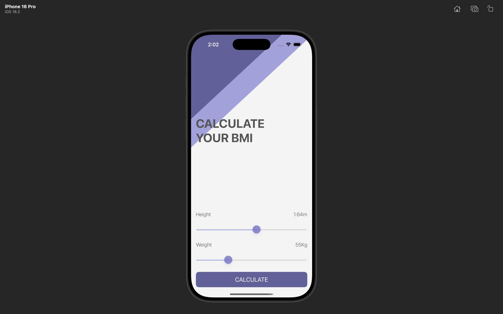
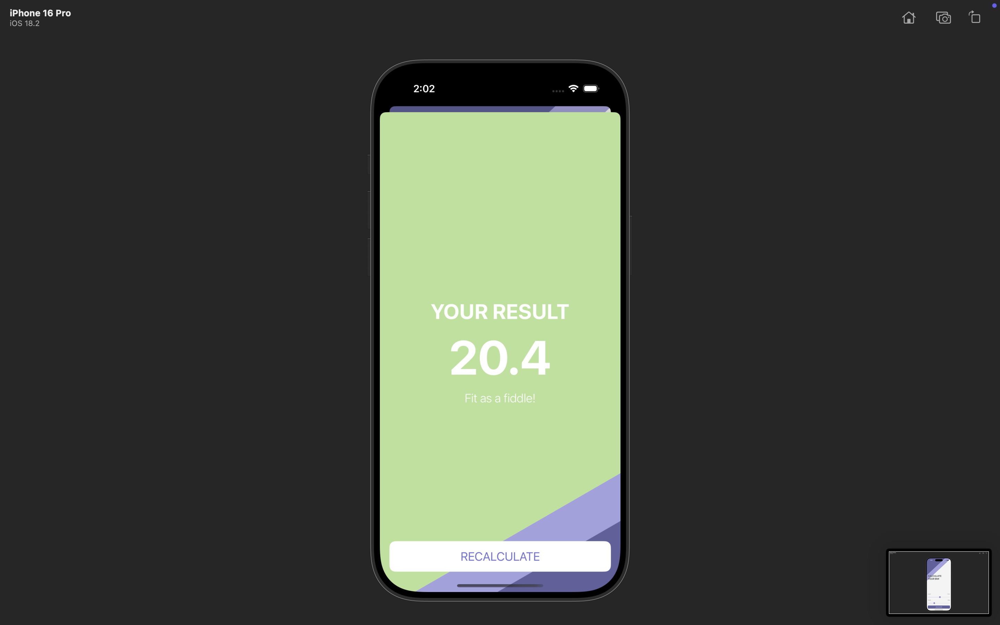

# BMI Calculator 

An iOS app that calculates Body Mass Index (BMI) based on user height and weight. The app also provides customized health advice depending on the result—whether the user is underweight, overweight, or within a healthy range.

## Features

- Clean and interactive multi-screen user interface with smooth navigation.
- Real-time BMI calculation based on user input.
- Personalized health suggestions.
- Color-coded feedback to visualize BMI category.

## Tech Stack
- Swift + UIKit
- MVC Architecture

## Screenshots

| Input Screen | Result Screen |
|--------------|------------------------|
|  |  |
